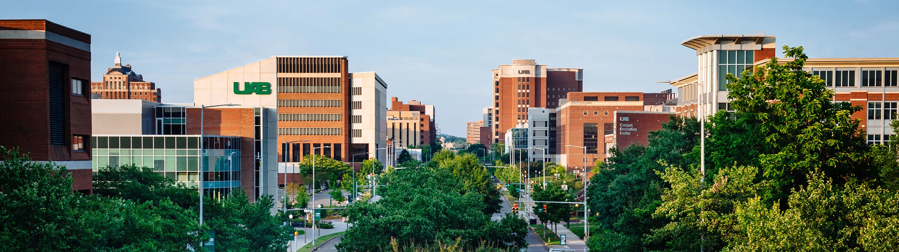

## Dou Lab @ UAB

We are a small computational biology group working at the intersection of **Statistics**, **Compute Science**, **Cancer**, and **Complex Disease**, seeking new ways to think about and work with human health. 

Right now, we are excited about the wealth of new data emerging from recent technological advancements, such as single-cell sequencing and spatial transcriptomic sequencing/imaging. These rich data types enable us to explore novel questions about biological phenomena, which we approach through quantitative modeling. Learn more about our recent [research](https://jinzhuangdou.github.io/doulab.github.io//pages/res.html) here.

We are looking for motivated students and postdocs to join us. If you are interested, please see [positions](https://jinzhuangdou.github.io/doulab.github.io//pages/positions.html). 

 
