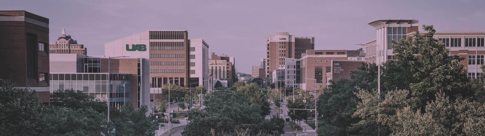

## Dou Lab @ UAB

We are a small computational biology group working at the intersection of **Statistics**, **Compute Science**, **Cancer**, and **Complex Disease**, seeking new ways to think about and work with human health. 

Currently, we are excited by the rich **new data types coming from recent technology**, such as single cell sequencing  and spatial transcriptomic sequencing/imaging. **These rich data types allow us to ask new questions about biological phenomena, and we like to cast these questions into quantitative models.**  

We are looking for motivated students and postdocs to join us. If you are interested, please contact the PI. 

 
