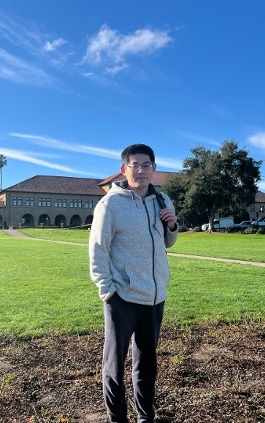

    

        
        

            
        

        

            <h3>Jinzhuang Dou</h3>
            Assitant Professor   
	    
	    <a href="https://www.uab.edu/medicine/informatics/about/welcome-to-dbids/">Department of Biomedical Informatics and Data Science</a> 	     
            <a href="https://www.uab.edu/medicine/home/">Heersink School of Medicine</a> 	    
	    <a href="../assets/jdou_cv.pdf">Download my CV</a> 
	    My Email:  jdou1@mdanderson.org
        

    

These topics have motivated some “general” methods development in Statistics, in the areas of change-point analysis, variable selection, model selection, and nonparametric inference.

