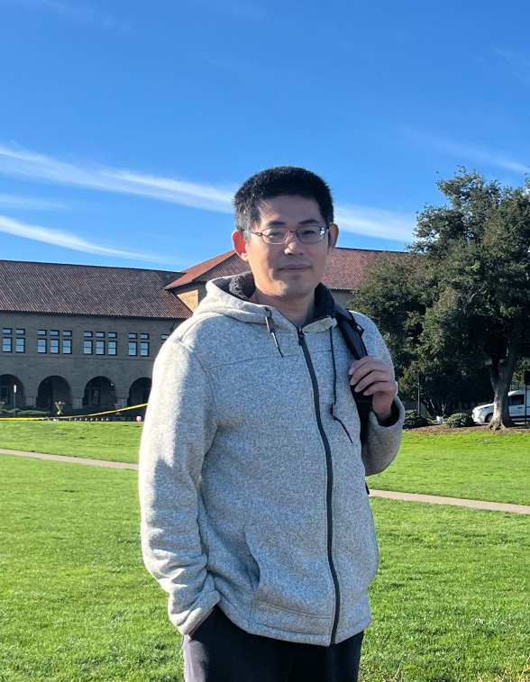

    

        
        

            
        

        

            <h3>Jinzhuang Dou</h3>
            Assitant Professor
	    <a href="https://www.uab.edu/medicine/informatics/about/welcome-to-dbids/">Department of Biomedical Informatics and Data Science</a> 	     
            <a href="https://www.uab.edu/medicine/home/">Heersink School of Medicine</a> 	    
	    <a href="../assets/nzhang_cv.pdf">Download my CV</a> 
	    My Email:  jdou1@mdanderson.org
        

    

When I was working towards a Bachelor’s in Mathematics at Stanford, the first draft of the human genome sequence was nearing completion, microarrays were transforming biological research, and the term “GWAS” had not yet been coined.  The idea of gaining a systemic understanding of biology – through quantitative modeling and mining of data from high throughput experiments – fascinated me.  But being a math major had nothing to do with knowing what to do with data :) so I went on to a Ph.D in Statistics and picked up the Biology I needed along the way.  

My research in statistical genetics have more or less tried to answer questions of the following two forms:  

- What questions can be meaningfully addressed using the data from a specific protocol?
- How can our procedure for answering these questions be made transparent, rigorous, and scalable?  

For the last several years my lab has been focusing on data from single cell and spatial transcriptomic experiments. 

The recurring themes in my research are copy number variant analysis, single-cell RNA-sequencing data analysis, bulk tissue deconvolution, and characterization of intratumor heterogeneity.  

These topics have motivated some “general” methods development in Statistics, in the areas of change-point analysis, variable selection, model selection, and nonparametric inference.

