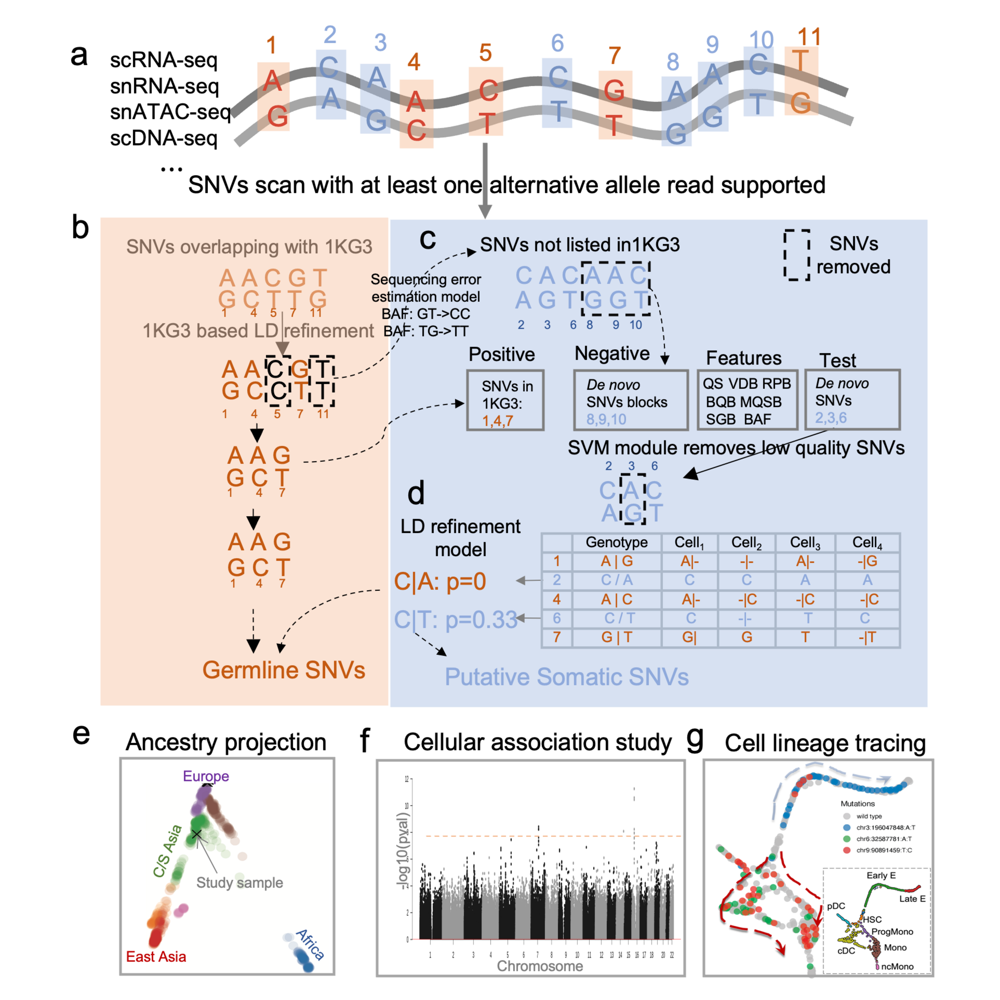
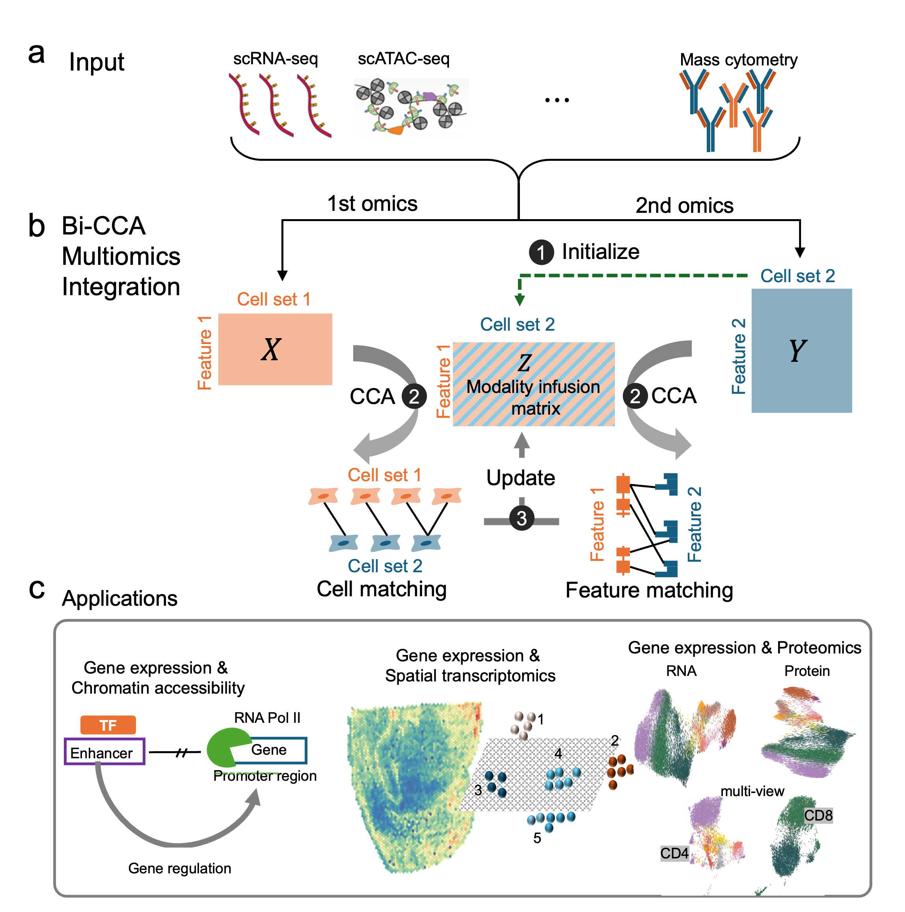
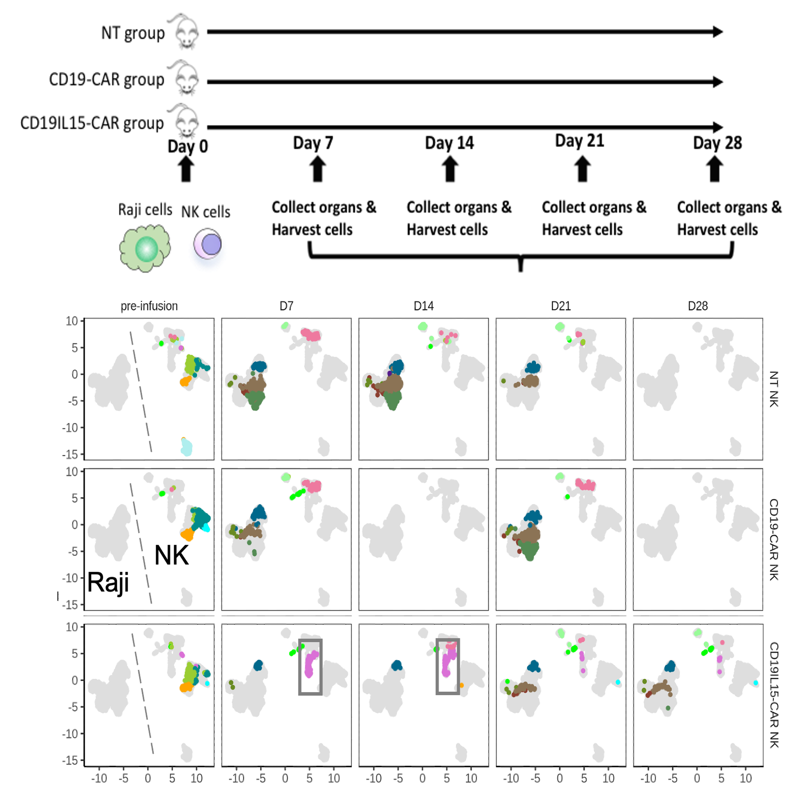
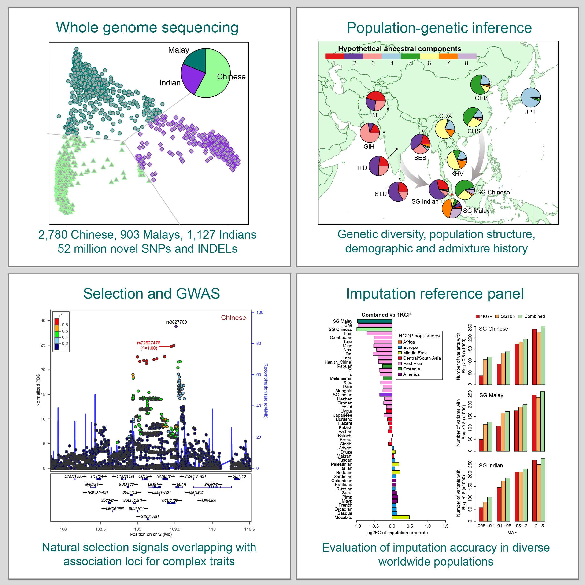

    

        <!-- First Figure -->
         <h3 style="font-size:16px;">Single Cell Genomics</h3>
         

            
        

        <!-- Text Description for Figure 1 -->
        

            We developed Monopogen <a href="https://www.nature.com/articles/s41587-023-01873-x" target="_blank">(Dou et al., 2023 Nature Biotech.)</a> to detect single-nucleotide variants (SNVs) from single-cell sequencing data. Monopogen-derived genotypes enable global and local ancestry inference and identification of admixed samples. It identifies variants associated with cellular phenotypes and also improves putative somatic SNV detection that enables clonal lineage tracing in cancer studies. This paper was highlighted in <a href="https://www.nature.com/articles/s41588-023-01544-2" target="_blank">Nature Genetics</a>   
        

       <!-- First Figure -->
         

            
        

        <!-- Text Description for Figure 1 -->
        

              We present a novel mathematical solution named bi-order canonical correlation analysis (bi-CCA) <a href="https://www.nature.com/articles/s41587-023-01873-x" target="_blank">(Dou et al., 2023 Genome Bio.)</a>, which extends the widely used CCA approach to iteratively align the rows and the columns between data matrices. Bi-CCA is generally applicable to combinations of any two single-cell modalities.    
        

      
    

     
    <!-- Second Figure -->
    

         <h3 style="font-size:16px;">Tumor Ecosystem</h3>
         

            
        

        <!-- Text Description for Figure 1 -->
        

        Through collaboration with NK immunologists, we characterized the interaction landscape between NK and tumor cells in an in vivo mouse model <a href="https://www.science.org/doi/full/10.1126/sciadv.add6997" target="_blank">(Li*, Vakul*, Dou* et al., 2023 Sci. Adv.)</a> . During the first two weeks, tumor burden and heterogeneity in the CAR19/IL-15 NK cell treatment group were remarkably lower than those in the CAR19 and NT-NK cell groups, attributed to the presence of a unique NK cluster (highlighted in the gray box).
        

    
    
     

    <!-- Third Row (Figure 2 and Description) -->
    

        <!-- Second Figure -->
        <h3 style="font-size:16px;">Population Genetics</h3>  
        

            
        

        <!-- Text Description for Figure 2 -->
        

            We were involved in the SG10K project. Because of Singapore's unique immigration history, the SG10K project <a href="https://www.cell.com/cell/fulltext/S0092-8674(19)31070-0?dgcid=raven_jbs_etoc_email" target="_blank">(Wu*, Dou*, Chai* et al., 2019 Cell)</a> provides a snapshot of the genetic diversity across East, Southeast, and South Asia, and offers insights into the population structure, demographic history, and natural selection of Asian populations. This paper was featured on the <a href="https://www.cell.com/cell/issue?pii=S0092-8674(18)X0022-1#fullCover" target="_blank">Cover of Cell</a>.    
        

    

